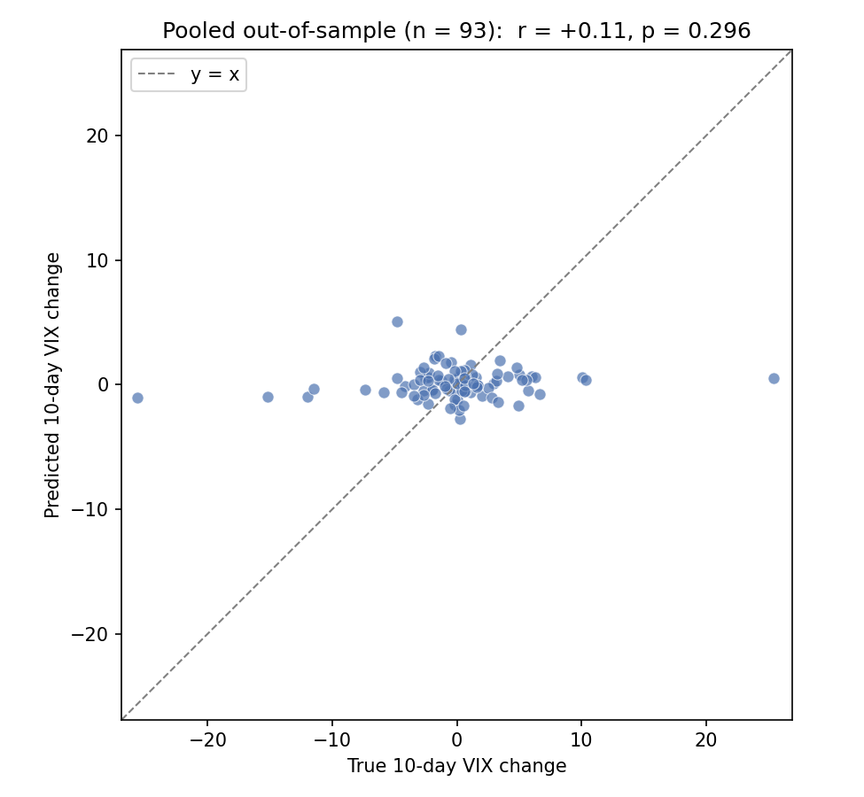
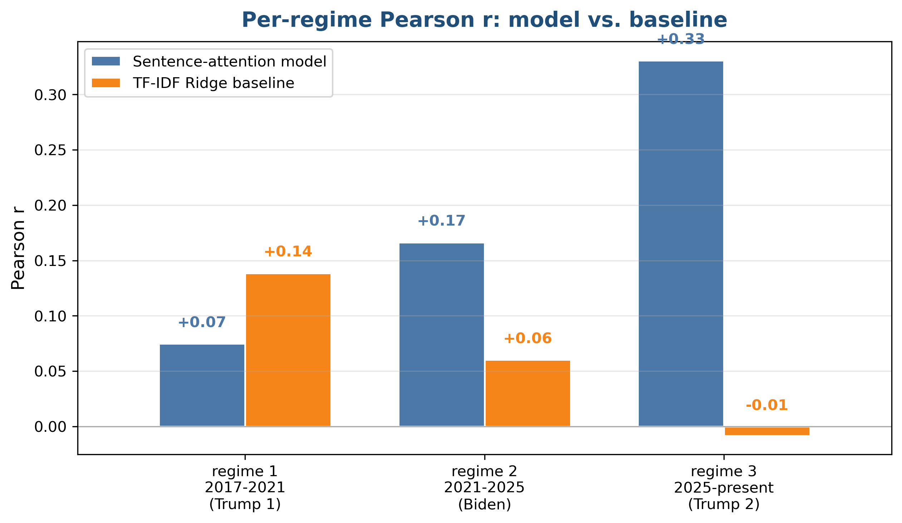

# Transcripts-Fed-VIX-DL

Predicting the 10-day forward change in the VIX (the stock market's "fear gauge") from Federal Reserve text, using a frozen FinBERT encoder, a learned additive (Bahdanau style) sentence attention aggregator, and a linear regression head.

DSCI 410/510 Final Project, Zoe Tomlinson.

## Project purpose

The Federal Reserve is the U.S. central bank. Its decisions about interest rates flow into the cost of credit, asset prices, and inflation, so markets read its communications closely. The VIX (CBOE Volatility Index) is the market's expectation of 30-day forward S&P 500 volatility, commonly called the investor fear gauge. This project asks two questions:

1. **Predictive (RQ1):** does the text of Fed communications (FOMC minutes and Humphrey-Hawkins testimony) predict the 10-day forward change in the VIX after each document's release? Prior work shows Fed text moves Treasury yields and equities (Hansen, McMahon and Prat 2018; Lucca and Trebbi 2009), so a short-horizon volatility signal is plausible.
2. **Temporal generalization (RQ2):** does that relationship hold across U.S. political regimes (Trump 1, Biden, Trump 2)? The Fed is formally independent, but a model trained on pre-2017 text might generalize poorly to later eras.

A full writeup with citations is in `docs/METHODOLOGY.md`.

## Dataset

326 documents scraped from federalreserve.gov and aligned to a FRED VIX series:

- **FOMC minutes**, 1993 to present, 268 documents.
- **Humphrey-Hawkins / Semiannual Monetary Policy Report testimony**, 1997 to present, 58 documents.

How it was created: `scripts/build_data.py` scrapes the raw HTML and PDF, segments each document into sentences with NLTK Punkt, keeps the first 80 sentences (which carry the policy rationale), and computes the target. `scripts/precompute_embeddings.py` then encodes every sentence once with `yiyanghkust/finbert-pretrain` and mask-weighted mean-pools it into a 768 dimensional vector. The encoder is frozen, so embeddings are deterministic and cached for reuse.

**Target:** the 10-day forward close-to-close change in the CBOE VIX (FRED `VIXCLS`), aligned to the next trading day so there is no look-ahead leakage on weekend or holiday releases.

**Splits** are strictly temporal, anchored to U.S. presidential inauguration days. The validation set is the most recent 15 percent of the pre-2017 pool and is used only for early stopping.

| Segment | Date range | n |
|---|---|---|
| Train | before 2017-01-20 (pool of 233, 198 after the val carve) | 198 |
| Val | last 15 percent of the pre-2017 pool | 35 |
| Regime 1 (Trump 1) | 2017-01-20 to 2021-01-20 | 40 |
| Regime 2 (Biden) | 2021-01-20 to 2025-01-20 | 40 |
| Regime 3 (Trump 2) | 2025-01-20 onward | 13 |

`notebooks/data_demo.ipynb` runs on 10 bundled example documents with no Talapas or FRED access.

## Model

`SentenceAttentionModel` (`src/transcripts_fed_vix/models/attention.py`). For one document, the 80 frozen FinBERT sentence embeddings (each 768 dimensional) are aggregated by additive attention: a small trained network scores each sentence, a softmax turns the scores into weights that sum to one, and the document vector is the weighted sum of the sentence embeddings. A single linear head maps that document vector to one scalar, the predicted 10-day VIX change. Only the attention and head train (about 99,000 parameters); FinBERT stays frozen, the standard choice for a small dataset. Model code lives in `src/transcripts_fed_vix/models/`, the dataset class in `src/transcripts_fed_vix/data/dataset.py`, and the training entry point in `scripts/train_model.py`.

## How to train

Local quick demo (no cluster needed):

```bash
git clone https://github.com/itszoetom/Transcripts-Fed-VIX-DL.git
cd Transcripts-Fed-VIX-DL
pip install -e .
jupyter notebook notebooks/data_demo.ipynb
```

Full pipeline on Talapas:

```bash
ssh ztomlins@login.talapas.uoregon.edu
cd ~/Transcripts-Fed-VIX-DL
pip install -e .
sbatch scripts/sweep.sbatch
```

`scripts/sweep.sbatch` runs scrape, sentence segmentation, VIX alignment, FinBERT precompute, a hyperparameter sweep over learning rate in {1e-4, 3e-4, 1e-3} crossed with attention dimension in {128, 256}, per-regime evaluation on the winner, the TF-IDF Ridge baseline, and figure generation. Each stage is idempotent. The winning configuration is saved to `outputs/winning_config.yaml`, and the pooled out-of-sample evaluation plus the directional classifier are produced by `scripts/run_final_eval.py`.

## Metrics

Reported per segment: **MSE** (training loss and a direct comparison against the baseline), **R squared** (variance explained, comparable across regimes of different volatility), and **Pearson r** with its **p-value** (a scale-free measure of whether predictions track the truth). For the directional reframing the project also reports classification **accuracy** and **AUC** against a majority-class baseline.

## Results

The honest result is a null. Fed text did not produce reliable out-of-sample prediction of the 10-day VIX change.

| Segment | n | Model r | Model p | Model MSE | Baseline r |
|---|---|---|---|---|---|
| Val | 35 | +0.34 | 0.045 | 6.6 | n/a |
| Regime 1 (Trump 1) | 40 | +0.07 | 0.65 | 45.2 | +0.14 |
| Regime 2 (Biden) | 40 | +0.17 | 0.30 | 21.7 | +0.06 |
| Regime 3 (Trump 2) | 13 | +0.33 | 0.27 | 3.0 | -0.01 |
| Pooled test (R1 plus R2 plus R3) | 93 | +0.11 | 0.30 | 29.2 | n/a |

No test segment is statistically significant (every p is above 0.05). On the pooled test set the R squared is slightly negative, meaning the model does no better than always predicting the mean, and the predictions barely move (standard deviation 1.2 against 5.4 for the true changes): the model defaults to predicting "no change" and misses the large moves. A TF-IDF plus Ridge baseline did just as well, and a directional up or down classifier reached an AUC of 0.51, no better than chance. The only significant number, validation r of 0.34, comes from the set used for model selection, so it is not a clean out-of-sample claim. All of these numbers and figures are regenerated from committed artifacts in `notebooks/eval.ipynb`.

## A visualization of the model's predictions

Pooled out-of-sample predictions against the truth. Every prediction sits in a narrow band near zero while the true changes span roughly plus or minus 25, the visual signature of a model that has learned to predict "no change."



Per-regime Pearson r for the model and the TF-IDF baseline:



## Limitations and use

- **Small training set.** About 198 training documents is small even with frozen embeddings. A learning curve (training on 25 to 100 percent of the data, `outputs/figures/learning_curve.png`) stays flat near zero, so data volume is not the bottleneck; the signal is.
- **Noisy, slow target.** The 10-day VIX change is dominated by market events, not by the language of a document released about three weeks after the meeting it summarizes.
- **Per-regime sample sizes.** Regime 3 has only 13 documents as of mid 2026, so its metrics are suggestive, not definitive.
- **Use case.** This is an academic study of whether the signal exists, not a trading model. Do not use the predictions for live trading.

Where a signal might actually live (future work): same-day FOMC statements instead of minutes, an intraday VIX target to catch the immediate reaction, and richer text such as speeches and press-conference transcripts.

## Data and model paths

- **GitHub, bundled example:** `data/example/example_documents.json`, `example_embeddings.pt`, `example_model.pt`. The demo notebooks run offline against these.
- **GitHub, committed results:** `outputs/model.pt` (trained weights, about 400 KB), `outputs/*.json` (per-segment, baseline, pooled, and learning-curve metrics), `outputs/figures/*.png`, and `outputs/winning_config.yaml`.
- **Talapas, full corpus:** `~/Transcripts-Fed-VIX-DL/data/raw/` (scraped HTML, PDF, text, and VIX cache) and `~/Transcripts-Fed-VIX-DL/data/processed/` (`documents.parquet`, `sentence_embeddings.pt`).
- **Talapas, all runs:** `~/Transcripts-Fed-VIX-DL/outputs/` (10-day, the primary model) and `~/Transcripts-Fed-VIX-DL/outputs_horizon_3/` (an earlier 3-day exploration).

## Repository layout

```
src/transcripts_fed_vix/
  data/       scraping, sentence segmentation, VIX alignment, Dataset class
  models/     frozen FinBERT encoder and additive sentence attention model
  training/   training loop, LR schedule, regression metrics
  utils/      seed, temporal splits, plotting helpers
configs/      default.yaml (canonical, 10-day) and sweep.yaml (the grid)
scripts/      build_data, precompute_embeddings, train_model, run_sweep,
              run_regime_analysis, run_baselines, run_final_eval, learning_curve,
              export_examples, make_plots, make_* (presentation figures),
              train.sbatch, sweep.sbatch
notebooks/    data_demo.ipynb (dataset and dataloader walkthrough),
              eval.ipynb (trained-model inference, figures, reported results)
outputs/      committed model weights, metric JSONs, and result figures
docs/         METHODOLOGY.md, MILESTONE_REPORT.md, DL410-Project-Proposal.docx
data/example/ 10 sample documents, embeddings, and trained model for the demo
```

## Environment

Python 3.9 or newer (tested on 3.12 and 3.13). A CUDA-enabled build of torch is needed only for the one-time FinBERT precompute step; everything else runs on CPU. The full scrape needs a free `FRED_API_KEY` (https://fred.stlouisfed.org/docs/api/api_key.html). On Talapas, use the miniforge3 base environment and export `LD_LIBRARY_PATH=$CONDA_PREFIX/lib:$LD_LIBRARY_PATH` before running so NLTK's compiled dependencies load.
